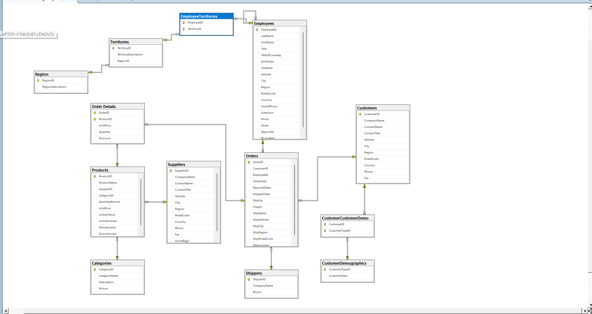

# Northwind: İş Akışı, Veri Modeli ve SQL Analizi

> **English summary:** I studied Microsoft's Northwind sample database (SQL Server) the way an analyst would approach an unfamiliar ERP-style system: first the business workflow, then the data model and table relationships, then SQL queries that answer business questions. The repo includes a workflow map, a schema diagram, and 8 T-SQL queries with findings (self-join, many-to-many bridge table, window functions).

## Amaç
ERP benzeri bir veri tabanıyla çalışmaya başlayan bir analistin izleyeceği sırayı uygulamak:
1. **İş akışını** anlamak
2. **Veri modelini ve tablo ilişkilerini** öğrenmek
3. **Sorgularla** iş sorularına cevap aramak

## Veri seti
Northwind, Microsoft'un eğitim amaçlı örnek veri tabanıdır (SQL Server). Küçük bir gıda ticareti şirketinin müşteri, sipariş, ürün, tedarikçi, sevkiyat ve çalışan verilerini içerir. Veri 1996-1998 dönemini kapsar; 91 müşteri ve 9 çalışan vardır.

## 1. İş akışı

| Adım | Süreç | İlgili tablolar |
|---|---|---|
| 1 | Müşteri sipariş verir | `Customers`, `Orders` |
| 2 | Siparişin kalemleri girilir | `Order Details` (ürün, miktar, fiyat, indirim) |
| 3 | Ürün stoktan düşer | `Products` (`UnitsInStock`, `ReorderLevel`) |
| 4 | Ürün tedarikçiden gelir | `Suppliers`, `Categories` |
| 5 | Sipariş sevk edilir | `Shippers`, `ShippedDate` |
| 6 | Siparişi hangi çalışan aldı | `Employees` |

## 2. Veri modeli



| "Bir" tarafı | "Çok" tarafı | Bağlantı |
|---|---|---|
| `Customers` | `Orders` | `CustomerID` |
| `Employees` | `Orders` | `EmployeeID` |
| `Shippers` | `Orders` | `ShipVia` |
| `Orders` | `Order Details` | `OrderID` |
| `Products` | `Order Details` | `ProductID` |
| `Categories` | `Products` | `CategoryID` |
| `Suppliers` | `Products` | `SupplierID` |
| `Region` | `Territories` | `RegionID` |
| `Employees` | `Employees` | `ReportsTo` (self-join, yönetici hiyerarşisi) |

**Çoktan çoğa ilişkiler (köprü tablolarla):**
- `Employees` ↔ `Territories`: `EmployeeTerritories`
- `Customers` ↔ `CustomerDemographics`: `CustomerCustomerDemo`

## 3. Sorgular ve bulgular

### 3.1 Çalışan ve yönetici hiyerarşisi (self-join)
```sql
SELECT e.FirstName + ' ' + e.LastName AS Calisan,
       m.FirstName + ' ' + m.LastName AS Yonetici
FROM Employees e
LEFT JOIN Employees m ON e.ReportsTo = m.EmployeeID;
```
> **Bulgu:** Andrew Fuller'ın yöneticisi yok, hiyerarşinin tepesi. 5 çalışan doğrudan ona, 3 çalışan Steven Buchanan'a bağlı.

### 3.2 Çalışan ve sorumlu bölge (çoktan çoğa)
```sql
SELECT e.FirstName + ' ' + e.LastName AS Calisan,
       t.TerritoryDescription AS SorumluBolge
FROM Employees e
LEFT JOIN EmployeeTerritories et ON e.EmployeeID = et.EmployeeID
LEFT JOIN Territories t ON t.TerritoryID = et.TerritoryID;
```
> **Bulgu:** Toplam 49 çalışan-bölge ataması var. `EmployeeTerritories` köprü tablosu olmadan bu ilişki tutulamazdı.

### 3.3 Çalışan başına bölge sayısı
```sql
SELECT e.FirstName + ' ' + e.LastName AS Calisan,
       COUNT(et.TerritoryID) AS BolgeSayisi
FROM Employees e
LEFT JOIN EmployeeTerritories et ON e.EmployeeID = et.EmployeeID
GROUP BY e.FirstName, e.LastName
ORDER BY BolgeSayisi DESC;
```
> **Bulgu:** Robert King en çok bölgeden sorumlu çalışan (10 bölge).

### 3.4 Sipariş toplamları
```sql
SELECT o.OrderID, o.CustomerID,
       CAST(SUM(od.UnitPrice * od.Quantity * (1 - od.Discount)) AS DECIMAL(12,2)) AS OrderTotal
FROM Orders o
JOIN [Order Details] od ON o.OrderID = od.OrderID
GROUP BY o.OrderID, o.CustomerID;
```
> **Bulgu:** ** En yüksek sipariş tutarı : 16387.5$'dır  VE En düşük sipariş tutarı: 12.5$'dır 

### 3.5 Cirosuna göre ilk 10 müşteri
```sql
SELECT TOP 10 c.CompanyName,
       CAST(SUM(od.UnitPrice * od.Quantity * (1 - od.Discount)) AS DECIMAL(12,2)) AS Ciro
FROM Customers c
JOIN Orders o ON c.CustomerID = o.CustomerID
JOIN [Order Details] od ON o.OrderID = od.OrderID
GROUP BY c.CompanyName
ORDER BY Ciro DESC;
```
> **Bulgu:** QUICK-Stop (~110K), Ernst Handel (~105K) ve Save-a-lot Markets (~104K) açık ara önde. Üçünün her biri dördüncü sıradaki müşterinin (~51K) yaklaşık iki katı ciro yapıyor.

### 3.6 Aylık ciro ve kümülatif toplam (window function)
```sql
WITH Aylik AS (
  SELECT DATEFROMPARTS(YEAR(o.OrderDate), MONTH(o.OrderDate), 1) AS Ay,
         SUM(od.UnitPrice * od.Quantity * (1 - od.Discount)) AS Ciro
  FROM Orders o
  JOIN [Order Details] od ON o.OrderID = od.OrderID
  GROUP BY YEAR(o.OrderDate), MONTH(o.OrderDate)
)
SELECT Ay,
       CAST(Ciro AS DECIMAL(12,2)) AS Ciro,
       CAST(SUM(Ciro) OVER (ORDER BY Ay) AS DECIMAL(12,2)) AS KumulatifCiro
FROM Aylik;
```
> **Bulgu:**
> En yüksek ciro Nisan 1998'de (123.798,68$), onu Mart 1998 (104.854,16$) ve Şubat 1998 (99.415,29$) izliyor. En yüksek üç ayın üçü de 1998'in ilk aylarında.
> En düşük ciro Ağustos 1996 (25.485,27$). Mayıs 1998 veri ayın başında bittiği için eksik bir ay (18.333,63$), karşılaştırmaya dahil edilmedi.
> Ciro dalgalı ama zaman içinde yükselen bir eğilimde.

### 3.7 Geciken sevkiyatlar (kargo firmasına göre)
```sql
SELECT s.CompanyName,
       COUNT(*) AS ToplamSevkiyat,
       SUM(CASE WHEN o.ShippedDate > o.RequiredDate THEN 1 ELSE 0 END) AS Geciken,
       CAST(100.0 * SUM(CASE WHEN o.ShippedDate > o.RequiredDate THEN 1 ELSE 0 END) / COUNT(*) AS DECIMAL(5,1)) AS GecikmeYuzdesi
FROM Orders o
JOIN Shippers s ON o.ShipVia = s.ShipperID
WHERE o.ShippedDate IS NOT NULL
GROUP BY s.CompanyName;
```
> **Bulgu:** Kargo firmalarının gecikme oranları :
  Federal Shipping: %3,6 (249 sevkiyatta 9 gecikme)   
  Speedy Express: %4,9 (245 sevkiyatta 12 gecikme)   
  United Package: %5,1 (315 sevkiyatta 16 gecikme)   
  (Hesaplamalar: 9/249 ≈ %3.61, 12/245 ≈ %4.90, 16/315 ≈ %5.08)

### 3.8 Kritik stoktaki ürünler
```sql
SELECT p.ProductName, su.CompanyName AS Tedarikci,
       p.UnitsInStock, p.UnitsOnOrder, p.ReorderLevel
FROM Products p
JOIN Suppliers su ON p.SupplierID = su.SupplierID
WHERE p.UnitsInStock + p.UnitsOnOrder < p.ReorderLevel
  AND p.Discontinued = 0;
```
> **Bulgu:** Kritik stok seviyesinde 2 ürün tespit edilmiştir. Bunlar;
  Nord-Ost Matjeshering — Tedarikçi: Nord-Ost-Fisch Handelsgesellschaft mbH   
  Outback Lager — Tedarikçi: Pavlova, Ltd. 

## Öğrendiklerim
- Veriye bakmadan önce **iş akışını** çıkarmak, hangi tabloya neden bakacağımı netleştirdi.
- Bire çok, **self-join** ve **çoktan çoğa (köprü tablo)** ilişkilerini gerçek tablolarda gördüm.
- `Order Details` satır bazlı olduğu için sipariş toplamı için `OrderID` bazında gruplamak gerekiyor.
- Para hesaplarında ondalık hataları `DECIMAL` ile engelledim.

## Klasör yapısı
```
├── README.md
├── assets/
│   ├── schema.png
│   └── workflow.png
└── sql/
    └── northwind_analysis.sql
```

## İletişim
[LinkedIn](https://www.linkedin.com/in/deniz-bal-64838b225) | [GitHub](https://github.com/DenizBAL)
